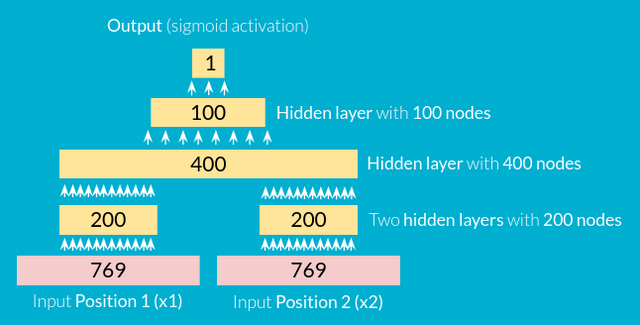
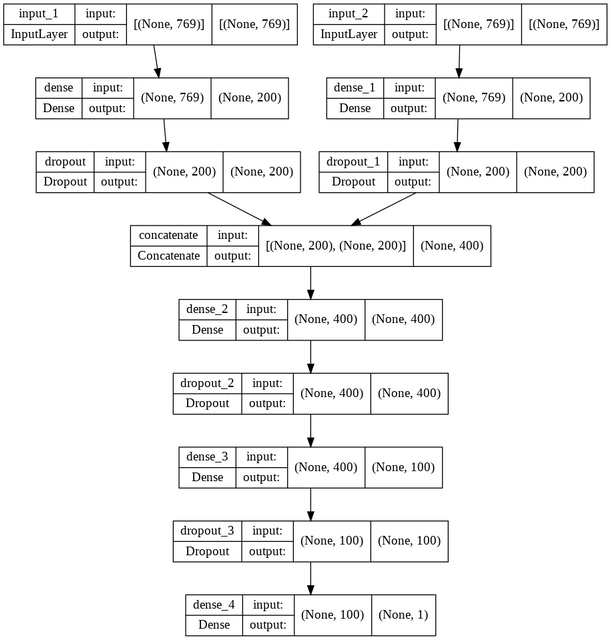

# *Neural Network Chess Engine*
## Final Project @ Spiced Academy | Sept. 2022

This Chess Engine was created in one week as the final project of the *2022 Spiced Academy - Data Science Bootcamp* in Berlin by Valentin Lorenzen.

It is fairly basic and makes a lot of mistakes, especially at the beginning of the game. It is currently running at a depth of two moves, meaning it calculates two moves into the future. Higher depth would require longer calculation time or a more efficient Alpha-Beta pruning search.

See if you can beat it and read up on how it was created below. 

---

#### Tech-Stack:

- Tensorflow/Keras
- Flask
- CSS/Javascript/Python/HTML

---

#### Resources:
* [DeepChess: End-to-End Deep Neural Network for Automatic Learning in Chess](https://www.cs.tau.ac.il/~wolf/papers/deepchess.pdf)
*by Omid E. David, Nathan S. Netanyahu, and Lior Wolf*

* [A TensorFlow implementation of "DeepChess: End-to-End Deep Neural Network for Automatic Learning in Chess"](https://github.com/oripress/DeepChess)
*by oripress*

* [python-chess: a chess library for Python](https://python-chess.readthedocs.io/)
*by Niklas Fiekas*

* [chessboard.js](https://chessboardjs.com/)
*by Chris Oakman*

* [FlaskChess](https://github.com/brokenloop/FlaskChess/)
*by brokenloop*

---

#### Tensorflow Model:
The engine is trained on the *CCRL computer chess database* consisting of 1'450'489 chess games. From those games 2'000'000 positions were extracted at random, 50% from games that white won at the end and 50% from games that black won at the end of the game.

The positions were first converted into the commonly used *FEN* format and then transformed into a *Bitboard - 769 bit* representation.

The Tensorflow model takes two of these positions as *input (x1 and x2)* and gives an *output (y)* between 0 and 1.
(1 meaning the position in input 1 is more winning for the white side than the position in input 2.)

The model consists of *7 layers.* Two input layers, two hidden layers extracting high level features from the input positions, two hidden layers computing the actual evaluation and one output layer with a sigmoid activation.

The Tensorflow structure looks as follows:

Four *dropout layers* were additionally used for adding noise to the training-process to prevent overfitting as well as *L2 Kernal-Regulization* at each layer. All layers, except the output layer, were activated through a *Rectified Linear Unit (ReLu) - activation.*

"Adam" was chosen as the optimzier as well as *Binary Crossentropy* as the loss-function.

The model reached a *validation accuracy of 87%* through 300 epochs of training with a Learning Rate that started at 0.001 and was multiplied by 0.99 at each epoch.
